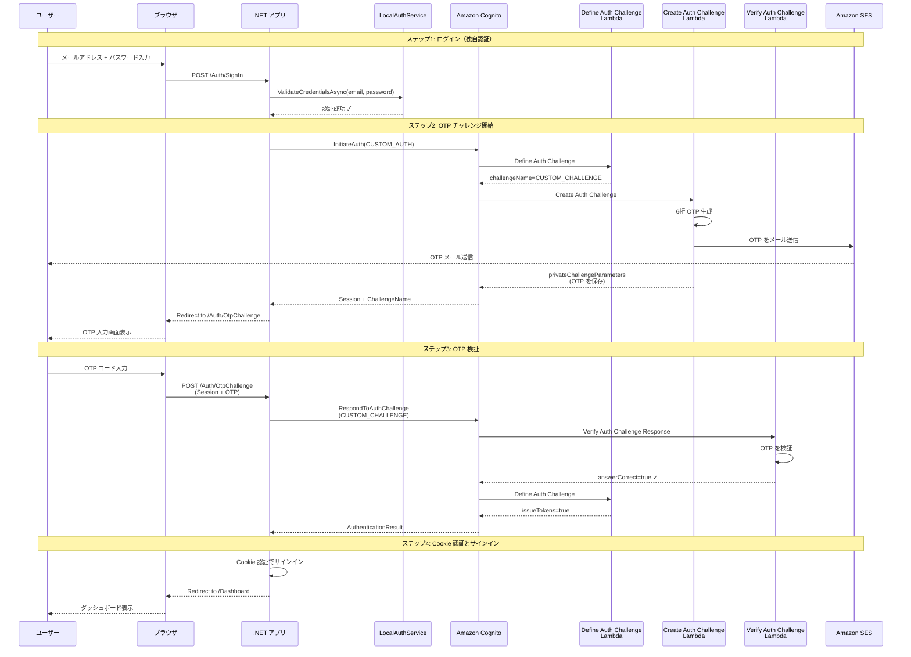

# Cognito CUSTOM_AUTH OTP サンプル (.NET 8)

.NET 8 と Amazon Cognito CUSTOM_AUTH を使用した、独自パスワード認証 + Email OTP による二段階認証のサンプルアプリケーションです。

## 概要

このサンプルアプリケーションは、以下の認証フローを実装しています：

1. **独自認証（ローカル）**: メールアドレスとパスワードでローカルユーザーを検証
2. **Cognito CUSTOM_AUTH**: 独自認証成功後、Cognito の CUSTOM_CHALLENGE フローで OTP をメール送信
3. **OTP 検証**: ユーザーが入力した OTP を Cognito Lambda で検証
4. **Cookie 認証**: OTP 検証成功後、Cookie でアプリケーションにサインイン

## 認証フロー図



## 技術スタック

- .NET 8
- ASP.NET Core MVC
- Amazon Cognito User Pools（CUSTOM_AUTH フロー）
- AWS Lambda（Define/Create/Verify Auth Challenge）
- Amazon SES（OTP メール送信）
- Cookie 認証

## このサンプルの評価と位置づけ

### Cognito の活用範囲

このサンプルは、**Cognito を「OTP 送信・検証サービス」として限定的に使用**しています。

#### ✅ 使用している Cognito の機能

| 機能 | 使用方法 |
|------|----------|
| **CUSTOM_AUTH フロー** | InitiateAuth / RespondToAuthChallenge による OTP チャレンジ |
| **Lambda トリガー** | Define/Create/Verify Auth Challenge での OTP 生成・検証ロジック |
| **チャレンジセッション管理** | Cognito が OTP チャレンジのセッションを管理 |
| **SES 連携（Lambda 経由）** | Create Auth Challenge Lambda から SES でメール送信 |

#### ❌ 使用していない Cognito の主要機能

| 機能 | 現状 |
|------|------|
| **ユーザー管理** | 独自実装（LocalAuthService のインメモリ）で代替 |
| **パスワード管理** | 独自実装で管理。Cognito のパスワードポリシー・リセット機能を未使用 |
| **JWT トークン認証** | AuthenticationResult のトークンを**破棄**し、Cookie 認証で代替 |
| **AccessToken / IdToken** | 取得しているが使用せず |
| **RefreshToken** | トークン更新の仕組みを未実装 |
| **標準認証フロー** | USER_PASSWORD_AUTH、SRP_AUTH などを未使用 |
| **標準 MFA** | TOTP、SMS MFA を未使用（OTP は CUSTOM_CHALLENGE で独自実装） |
| **セキュリティ機能** | アカウントロック、リスクベース認証、グループ・ロール管理を未使用 |

### このサンプルの特徴

#### 設計思想

このサンプルは、以下のような要件を想定しています：

- **既存の独自認証システムが存在**し、それを維持したい
- **OTP による二要素認証を追加**したいが、認証基盤全体を Cognito に移行したくない
- **アプリケーションのセッション管理は独自実装**（Cookie）を継続したい

#### 実装の位置づけ

```
完全独自実装 ←──── このサンプル ────→ 完全 Cognito 移行

[独自Auth + 独自OTP]  [独自Auth + Cognito OTP]  [Cognito Auth + Cognito MFA]
```

このサンプルは、**独自認証システムと Cognito の中間的なアプローチ**です。

### メリット

1. **段階的な移行が可能**
   - 既存の認証システムを維持しながら、OTP 機能だけ Cognito を利用
   - 将来的に完全移行する際の足がかりになる

2. **OTP 実装の複雑さを Cognito に委譲**
   - OTP 生成ロジック
   - セッション管理
   - Lambda での柔軟なカスタマイズ

3. **SES との連携が容易**
   - Lambda から SES を呼び出すだけでメール送信が可能

### デメリット

1. **Cognito の本来の価値を活用できていない**
   - JWT トークンベース認証の恩恵を受けられない
   - ユーザー管理、パスワード管理などの高度な機能が未使用

2. **二重のユーザー管理が必要**
   - ローカル（独自実装）と Cognito User Pool の両方でユーザーを管理
   - メールアドレスの同期が必要

3. **コスト面での非効率**
   - Cognito の料金は発生するが、機能の一部しか使っていない
   - Lambda 実行コストも追加で発生

4. **複雑性の増加**
   - 独自認証 + Cognito + Cookie 認証の3層構造
   - トラブルシューティングが複雑

### このサンプルが適している場面

- ✅ 既存の独自認証システムがあり、それを維持したい場合
- ✅ OTP 機能だけを追加したい場合
- ✅ 将来的に Cognito への完全移行を検討している場合（段階的移行の第一歩）
- ✅ Lambda で OTP のカスタマイズロジックを実装したい場合

### このサンプルが適していない場面

- ❌ 新規プロジェクトで認証基盤を構築する場合
  - → Cognito の標準フロー（USER_PASSWORD_AUTH + TOTP/SMS MFA）を推奨
- ❌ JWT トークンベース認証を採用したい場合
  - → Cognito の JWT トークンをそのまま使用
- ❌ マイクロサービスや API 間認証が必要な場合
  - → Cognito の AccessToken を使った認可が適切

### 重要な注意点

#### トークンの破棄について

`CognitoCustomOtpService.cs` の実装では、Cognito から返される `AuthenticationResult` に含まれる JWT トークン（AccessToken、IdToken、RefreshToken）を取得していますが、**単なる成功判定にのみ使用し、その後破棄**しています。

```csharp
// CognitoCustomOtpService.cs:89-92
if (response.AuthenticationResult != null)
{
    _logger.LogInformation("OTP verification successful for user: {Email}", email);
    return true;  // ← トークンを破棄
}
```

本来、これらのトークンは以下の用途で使用されるべきものです：

- **AccessToken**: API アクセスの認可、ユーザー情報取得
- **IdToken**: ユーザー属性情報（クレーム）の取得
- **RefreshToken**: トークンの更新

このサンプルでは、代わりに Cookie 認証を使用しているため、Cognito のトークン管理機能は活用されていません。

## プロジェクト構成

```
CognitoCustomOtpSample/
├── Controllers/
│   ├── AuthController.cs          # 認証フロー（SignIn, OtpChallenge, Logout）
│   └── DashboardController.cs     # ログイン後のダッシュボード
├── Models/
│   └── AuthViewModels.cs          # ViewModel（SignIn, OtpChallenge）
├── Services/
│   ├── ILocalAuthService.cs       # 独自認証サービス（インターフェース）
│   ├── LocalAuthService.cs        # 独自認証サービス（実装）
│   ├── ICognitoCustomOtpService.cs # Cognito CUSTOM_AUTH サービス（インターフェース）
│   └── CognitoCustomOtpService.cs  # Cognito CUSTOM_AUTH サービス（実装）
├── Views/
│   ├── Auth/
│   │   ├── SignIn.cshtml          # ログイン画面
│   │   └── OtpChallenge.cshtml    # OTP 入力画面
│   └── Dashboard/
│       └── Index.cshtml           # ダッシュボード
├── appsettings.json
├── appsettings.Development.json
└── Program.cs
```

## 開発環境セットアップ手順

### 1. Amazon Cognito User Pool の設定

#### User Pool の作成

1. AWS コンソールで **Amazon Cognito** を開く
2. **ユーザープールを作成** をクリック

#### サインイン体験の設定

- **Cognito ユーザープールのサインインオプション**: `Eメール` にチェック

#### セキュリティ要件の設定

- **パスワードポリシー**: デフォルト設定
- **多要素認証（MFA）**: `MFA なし` を選択（CUSTOM_AUTH で OTP を実装するため）

#### サインアップ体験の設定

- **自己登録**: `自己登録を有効にする` にチェック（必要に応じて）
- **属性検証**: E メールアドレスを確認
- **必須の属性**: `email` のみ

#### メッセージ配信の設定

- **E メール**: `Cognito で E メールを送信` を選択（開発/テスト環境向け）
  - 本番環境では SES を使用することを推奨

#### アプリケーションの統合

- **ユーザープール名**: 任意（例: `custom-otp-pool`）
- **アプリケーションタイプ**: `パブリッククライアント`
- **アプリケーションクライアント名**: 任意（例: `custom-otp-client`）
- **クライアントシークレット**: `クライアントシークレットを生成しない`（または生成する場合は appsettings.json に設定）
- **認証フロー**: **`ALLOW_CUSTOM_AUTH`** を有効化（重要！）
  - `ALLOW_REFRESH_TOKEN_AUTH` も有効化（推奨）

#### 設定値の取得

作成後、以下の値をメモ：

| 項目 | 取得場所 |
|------|----------|
| User Pool ID | ユーザープール概要ページ（例: `ap-northeast-1_XXXXXXXXX`） |
| Client ID | アプリケーションの統合 > アプリクライアント |
| Client Secret | アプリクライアント詳細（生成した場合のみ） |

---

### 2. Lambda トリガーの設定

Cognito User Pool の **ユーザープールのプロパティ** > **Lambda トリガー** で以下の 3 つのトリガーを設定します：

1. **Define Auth Challenge**: 認証フローの定義
2. **Create Auth Challenge**: OTP の生成とメール送信
3. **Verify Auth Challenge Response**: OTP の検証

#### Lambda 関数の作成

AWS Lambda コンソールで 3 つの Lambda 関数を作成します（Node.js 18.x 推奨）。

##### 1. Define Auth Challenge

認証フローを定義する Lambda です。

```javascript
exports.handler = async (event) => {
    console.log('DefineAuthChallenge:', JSON.stringify(event, null, 2));

    const session = event.request.session;

    // セッションが空の場合、最初のチャレンジを開始
    if (session.length === 0) {
        event.response.issueTokens = false;
        event.response.failAuthentication = false;
        event.response.challengeName = 'CUSTOM_CHALLENGE';
    }
    // 1回目のチャレンジが成功した場合
    else if (session.length === 1 && session[0].challengeName === 'CUSTOM_CHALLENGE' && session[0].challengeResult === true) {
        event.response.issueTokens = true;
        event.response.failAuthentication = false;
    }
    // チャレンジ失敗または最大試行回数超過
    else {
        event.response.issueTokens = false;
        event.response.failAuthentication = true;
    }

    console.log('DefineAuthChallenge Response:', JSON.stringify(event.response, null, 2));
    return event;
};
```

##### 2. Create Auth Challenge

OTP を生成してメール送信する Lambda です。

```javascript
const AWS = require('aws-sdk');
const ses = new AWS.SES({ region: 'ap-northeast-1' }); // SES のリージョンを指定

exports.handler = async (event) => {
    console.log('CreateAuthChallenge:', JSON.stringify(event, null, 2));

    // 6桁の OTP を生成
    const otp = Math.floor(100000 + Math.random() * 900000).toString();

    // OTP を privateChallenge に保存（検証時に使用）
    event.response.privateChallengeParameters = {
        answer: otp
    };

    // クライアントに送信するパラメータ（必要に応じて）
    event.response.challengeMetadata = 'OTP_CHALLENGE';

    // ユーザーのメールアドレスを取得
    const email = event.request.userAttributes.email;

    // SES で OTP をメール送信
    const params = {
        Source: 'noreply@yourdomain.com', // 送信元メールアドレス（SES で検証済みのアドレス）
        Destination: {
            ToAddresses: [email]
        },
        Message: {
            Subject: {
                Data: 'ワンタイムパスワード',
                Charset: 'UTF-8'
            },
            Body: {
                Text: {
                    Data: `あなたのワンタイムパスワードは: ${otp}\n\nこのコードは 5 分間有効です。`,
                    Charset: 'UTF-8'
                }
            }
        }
    };

    try {
        await ses.sendEmail(params).promise();
        console.log(`OTP sent to ${email}: ${otp}`);
    } catch (error) {
        console.error('Failed to send OTP email:', error);
        throw error;
    }

    console.log('CreateAuthChallenge Response:', JSON.stringify(event.response, null, 2));
    return event;
};
```

**重要**: Lambda の実行ロールに SES の送信権限を付与してください：

```json
{
    "Version": "2012-10-17",
    "Statement": [
        {
            "Effect": "Allow",
            "Action": [
                "ses:SendEmail",
                "ses:SendRawEmail"
            ],
            "Resource": "*"
        }
    ]
}
```

##### 3. Verify Auth Challenge Response

ユーザーが入力した OTP を検証する Lambda です。

```javascript
exports.handler = async (event) => {
    console.log('VerifyAuthChallengeResponse:', JSON.stringify(event, null, 2));

    const expectedAnswer = event.request.privateChallengeParameters.answer;
    const userAnswer = event.request.challengeAnswer;

    console.log(`Expected: ${expectedAnswer}, User answer: ${userAnswer}`);

    // OTP が一致するか検証
    if (userAnswer === expectedAnswer) {
        event.response.answerCorrect = true;
    } else {
        event.response.answerCorrect = false;
    }

    console.log('VerifyAuthChallengeResponse Response:', JSON.stringify(event.response, null, 2));
    return event;
};
```

#### Lambda トリガーの設定

Cognito User Pool に戻り、**Lambda トリガー** タブで以下を設定：

| トリガー | Lambda 関数 |
|---------|------------|
| Define auth challenge | Define Auth Challenge Lambda の ARN |
| Create auth challenge | Create Auth Challenge Lambda の ARN |
| Verify auth challenge response | Verify Auth Challenge Response Lambda の ARN |

---

### 3. Amazon SES の設定

#### メールアドレスの検証（開発環境）

開発環境では、SES サンドボックスモードで動作するため、送信元と送信先の両方のメールアドレスを検証する必要があります。

1. SES コンソールを開く
2. **検証済み ID** > **ID を作成**
3. **E メールアドレス** を選択
4. 送信元メールアドレス（例: `noreply@yourdomain.com`）を入力して作成
5. 受信したメールのリンクをクリックして検証
6. テスト用の受信メールアドレスも同様に検証

#### 本番環境への移行

本番環境では、SES サンドボックスからの移行をリクエストしてください：

1. SES コンソール > **アカウントダッシュボード**
2. **本番アクセスのリクエスト** をクリック
3. 必要情報を入力して送信

---

### 4. AWS CLI の設定

#### AWS CLI のインストール

macOS:
```bash
brew install awscli
```

Windows:
```bash
winget install Amazon.AWSCLI
```

#### IAM ユーザーの作成とアクセスキー取得

1. AWS コンソールで **IAM** を開く
2. **ユーザー** > **ユーザーを作成**
3. ユーザー名を入力して次へ
4. **ポリシーを直接アタッチ** で以下を選択：
   - `AmazonCognitoPowerUser`（Cognito へのアクセス）
5. ユーザー作成後、**セキュリティ認証情報** タブで **アクセスキーを作成**
6. **CLI** を選択してアクセスキーを作成
7. アクセスキー ID とシークレットアクセスキーをメモ

#### AWS CLI の設定

```bash
aws configure
```

プロンプトに従って入力：
```
AWS Access Key ID: [取得したアクセスキーID]
AWS Secret Access Key: [取得したシークレットアクセスキー]
Default region name: ap-northeast-1
Default output format: json
```

設定確認：
```bash
aws sts get-caller-identity
```

---

### 5. Cognito にテストユーザーを作成

AWS CLI または Cognito コンソールでテストユーザーを作成します。

#### CLI で作成する場合

```bash
aws cognito-idp admin-create-user \
  --user-pool-id ap-northeast-1_XXXXXXXXX \
  --username user@example.com \
  --user-attributes Name=email,Value=user@example.com Name=email_verified,Value=true \
  --message-action SUPPRESS
```

ユーザーのパスワードを設定：
```bash
aws cognito-idp admin-set-user-password \
  --user-pool-id ap-northeast-1_XXXXXXXXX \
  --username user@example.com \
  --password Password123! \
  --permanent
```

**注意**: このアプリケーションでは、独自認証（ローカル）とCognito の両方で同じメールアドレスが必要です。

- **ローカル認証**: `LocalAuthService.cs` のインメモリユーザー
- **Cognito**: User Pool に登録されたユーザー

両方で `user@example.com` が存在する必要があります。

---

### 6. appsettings.json の設定

`appsettings.json` を編集：

```json
{
  "Logging": {
    "LogLevel": {
      "Default": "Information",
      "Microsoft.AspNetCore": "Warning"
    }
  },
  "AllowedHosts": "*",
  "AWS": {
    "Cognito": {
      "Region": "ap-northeast-1",
      "UserPoolId": "ap-northeast-1_XXXXXXXXX",
      "ClientId": "xxxxxxxxxxxxxxxxxxxxxxxxxx",
      "ClientSecret": ""
    }
  }
}
```

| 項目 | 説明 |
|------|------|
| Region | User Pool のリージョン |
| UserPoolId | Cognito User Pool ID |
| ClientId | アプリクライアント ID |
| ClientSecret | クライアントシークレット（生成した場合のみ。空の場合は SECRET_HASH 計算をスキップ） |

---

### 7. アプリケーションの実行

```bash
cd CognitoCustomOtpSample
dotnet restore
dotnet run
```

ブラウザで http://localhost:5000 にアクセス

#### テスト手順

1. ログイン画面で以下のいずれかのユーザーでログイン：
   - `user@example.com` / `Password123!`
   - `test@example.com` / `Test123456!`

2. 独自認証が成功すると、OTP がメールに送信され、OTP 入力画面へリダイレクト

3. メールに届いた 6 桁の OTP を入力

4. OTP 検証が成功すると、ダッシュボードへリダイレクト

---

## 重要な実装ポイント

### 1. SECRET_HASH の計算

ClientSecret が設定されている場合、`InitiateAuth` と `RespondToAuthChallenge` のリクエストに SECRET_HASH を含める必要があります。

実装は `CognitoCustomOtpService.cs:CalculateSecretHash()` を参照してください。

### 2. ClientMetadata の制限

Cognito の仕様上、`InitiateAuth` で渡した `ClientMetadata` は Lambda トリガー（Define/Create/Verify）には渡されません。

そのため、独自認証の結果を Cognito 側に渡すことはできません。このサンプルでは、独自認証を先に実施し、成功した場合のみ Cognito の CUSTOM_AUTH を呼び出す設計にしています。

### 3. OTP の有効期限

このサンプルでは OTP の有効期限は実装していませんが、本番環境では以下の対応を推奨：

- Lambda の `CreateAuthChallenge` で OTP 生成時のタイムスタンプを `privateChallengeParameters` に保存
- `VerifyAuthChallengeResponse` で現在時刻との差分をチェック（例: 5 分以内）

### 4. 最大試行回数

このサンプルでは、`DefineAuthChallenge` で 1 回のチャレンジのみ許可しています。

リトライを許可する場合は、セッションの長さをチェックして、最大試行回数（例: 3 回）を超えたら `failAuthentication = true` にしてください。

### 5. レート制限

Cognito には組み込みのレート制限がありますが、追加の保護として以下を検討してください：

- AWS WAF でリクエスト数を制限
- Lambda 側でユーザーごとの試行回数を DynamoDB で管理
- 短時間に複数回失敗したユーザーを一時的にブロック

### 6. ユーザー列挙対策

Cognito の `PreventUserExistenceErrors` 設定を有効にすることで、存在しないユーザーへのログイン試行時に異なるエラーメッセージを返さないようにできます。

User Pool の設定で確認してください。

---

## トラブルシューティング

### OTP メールが届かない

- SES のメールアドレスが検証済みか確認
- Lambda の実行ロールに SES 送信権限があるか確認
- CloudWatch Logs で Lambda のログを確認
- SES サンドボックスモードの場合、送信先アドレスも検証済みか確認

### CUSTOM_AUTH が有効になっていない

- Cognito User Pool のアプリクライアント設定で `ALLOW_CUSTOM_AUTH` が有効か確認

### SECRET_HASH エラー

- ClientSecret が設定されている場合、`CognitoCustomOtpService.cs` で SECRET_HASH を計算しているか確認
- USERNAME + ClientId の順序で HMAC-SHA256 を計算

### Lambda トリガーが呼ばれない

- Cognito User Pool の Lambda トリガー設定が正しいか確認
- Lambda 関数の実行ロールに Cognito からの呼び出し権限があるか確認（通常は自動付与）

---

## セキュリティ上の注意

1. **ClientSecret の管理**: 本番環境では、appsettings.json に直接記載せず、環境変数や AWS Secrets Manager を使用してください
2. **HTTPS の使用**: 本番環境では必ず HTTPS を使用してください
3. **OTP の有効期限**: 本番環境では OTP に有効期限（例: 5 分）を設定してください
4. **レート制限**: ブルートフォース攻撃対策として、ログイン試行回数の制限を実装してください
5. **ログ出力**: OTP などの機密情報をログに出力しないようにしてください

---

## ライセンス

MIT License
