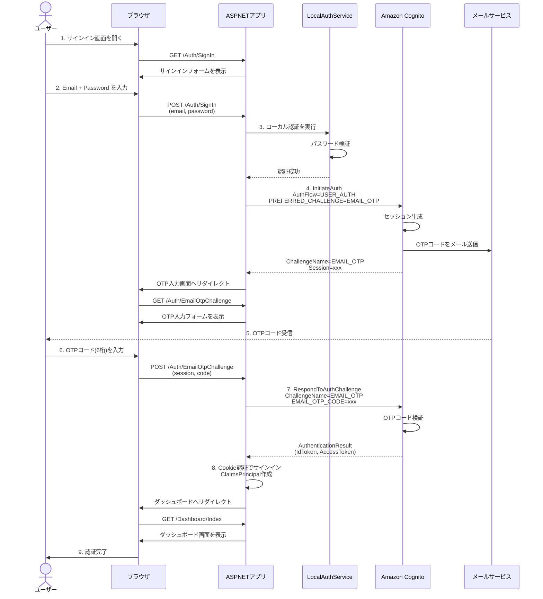

# Cognito Email OTP サンプルアプリケーション

このプロジェクトは、**既存の独自パスワード認証を残したまま、Email OTP のみを Amazon Cognito User Pools で実施する**デモアプリケーションです。

## 📋 目的

- ローカルのパスワード認証で第一段階の認証を行う
- Cognito では Email OTP チャレンジのみを実行（二重パスワードを回避）
- アプリのログイン状態は Cookie 認証で保持
- Cognito のトークンは認証確認のみに使用（アプリ内の認証には使用しない）

## 🚀 技術スタック

- .NET 8
- ASP.NET Core MVC
- Amazon Cognito User Pools（AWS SDK for .NET）
- Cookie 認証

## 📁 プロジェクト構成

```
CognitoEmailOtpSample/
├── Controllers/
│   ├── AuthController.cs          # 認証フロー（SignIn / EmailOtpChallenge）
│   └── DashboardController.cs     # ログイン後のダッシュボード
├── Services/
│   ├── ICognitoEmailOtpService.cs # Cognito Email OTP インターフェース
│   ├── CognitoEmailOtpService.cs  # Cognito Email OTP 実装
│   ├── ILocalAuthService.cs       # ローカル認証インターフェース
│   └── LocalAuthService.cs        # ローカル認証実装（インメモリ）
├── Models/
│   ├── SignInViewModel.cs         # サインインフォーム用モデル
│   └── OtpChallengeViewModel.cs   # OTP検証フォーム用モデル
├── Views/
│   ├── Auth/
│   │   ├── SignIn.cshtml          # サインイン画面
│   │   └── EmailOtpChallenge.cshtml # OTP入力画面
│   └── Dashboard/
│       └── Index.cshtml            # ダッシュボード画面
└── appsettings.json                # 設定ファイル
```

## ⚙️ セットアップ手順

### 1. AWS Cognito User Pool の設定

#### 1.1 User Pool の作成

1. AWS マネジメントコンソールにログイン
2. Amazon Cognito サービスを開く
3. 「ユーザープールを作成」をクリック
4. 以下の設定で作成：

**サインインエクスペリエンスの設定**
- サインインオプション: `Email`
- ユーザー名の要件: デフォルトのまま

**セキュリティ要件の設定**
- パスワードポリシー: デフォルト（本サンプルではCognitoパスワードは使用しない）
- MFA: `No MFA`（Email OTP を使用するため）
- ユーザーアカウントの復旧: `Email のみ`

**サインアップエクスペリエンスの設定**
- セルフサービスサインアップ: `無効`（既存ユーザーのみ）
- 必須属性: `email`

**メッセージ配信の設定**
- Eメール: `Cognito で E メールを送信` （テスト用）
  - 本番環境では SES の使用を推奨

**アプリケーションの統合**
- ユーザープール名: 任意（例: `email-otp-test-pool`）
- アプリケーションクライアント名: 任意（例: `email-otp-client`）
- クライアントシークレット: `クライアントシークレットを生成` をチェック（推奨）

#### 1.2 認証フローの設定（重要）

1. 作成したユーザープールを開く
2. 「アプリケーションの統合」タブを選択
3. 作成したアプリクライアントをクリック
4. 「編集」をクリック
5. **認証フロー** で以下を有効化：
   - ✅ `ALLOW_USER_AUTH`
   - ✅ `ALLOW_REFRESH_TOKEN_AUTH`

6. 保存

#### 1.3 Email OTP の有効化

1. ユーザープール → 「サインインエクスペリエンス」タブ
2. 「MFA」セクションで「編集」をクリック
3. **USER_AUTH 認証フロー** で以下を設定：
   - ✅ `Email OTP` を有効化
4. 保存

#### 1.4 テストユーザーの作成

1. ユーザープール → 「ユーザー」タブ
2. 「ユーザーを作成」をクリック
3. 以下の情報を入力：
   - Eメールアドレス: `user@example.com`（ローカル認証のテストユーザーと同じ）
   - 一時パスワード: 任意（本サンプルでは使用しない）
   - ✅ 「Eメールを確認済みとしてマークする」をチェック
4. 「ユーザーを作成」

**注意**: ローカル認証のテストユーザー（`user@example.com` / `test@example.com`）と同じメールアドレスで Cognito ユーザーを作成してください。

### 2. アプリケーションの設定

#### 2.1 AWS 認証情報の設定

以下のいずれかの方法で AWS 認証情報を設定：

**方法1: AWS CLI で設定（推奨）**
```bash
aws configure
```

**方法2: 環境変数で設定**
```bash
export AWS_ACCESS_KEY_ID=your-access-key
export AWS_SECRET_ACCESS_KEY=your-secret-key
export AWS_REGION=ap-northeast-1
```

#### 2.2 appsettings.Development.json の編集

プロジェクトルートの `appsettings.Development.json` を開き、以下を設定：

```json
{
  "AWS": {
    "Region": "ap-northeast-1",
    "Cognito": {
      "UserPoolId": "ap-northeast-1_XXXXXXXXX",  // ← User Pool ID を入力
      "ClientId": "your-client-id",               // ← アプリクライアント ID を入力
      "ClientSecret": "your-client-secret"        // ← クライアントシークレットを入力（任意）
    }
  }
}
```

**設定値の取得方法**:
- **UserPoolId**: Cognito User Pool の「一般設定」タブにある「プール ID」
- **ClientId**: 「アプリケーションの統合」タブ → アプリクライアント → 「クライアント ID」
- **ClientSecret**: 「アプリケーションの統合」タブ → アプリクライアント → 「クライアントのシークレット」
  - クライアントシークレットがない場合は空文字 `""` を設定

### 3. アプリケーションの実行

```bash
cd CognitoEmailOtpSample
dotnet restore
dotnet build
dotnet run
```

ブラウザで `https://localhost:5001` （または表示されたURL）にアクセス。

## 🔐 認証フロー

### シーケンス図



### フロー概要

```
[ユーザー]
    ↓
[1] メールアドレス + パスワード入力 (/Auth/SignIn)
    ↓
[2] ローカル認証（LocalAuthService）
    ↓ 成功
[3] Cognito Email OTP チャレンジ開始（InitiateAuth）
    - AuthFlow = USER_AUTH
    - PREFERRED_CHALLENGE = EMAIL_OTP
    ↓
[4] メールで OTP コード受信
    ↓
[5] OTP コード入力 (/Auth/EmailOtpChallenge)
    ↓
[6] OTP 検証（RespondToAuthChallenge）
    - ChallengeName = EMAIL_OTP
    ↓ 成功
[7] Cookie 認証でサインイン
    ↓
[8] ダッシュボード表示 (/Dashboard/Index)
```

## 🧪 動作確認手順

### 手順1: サインイン画面でローカル認証

1. アプリケーションを起動
2. サインイン画面が表示される
3. 以下のテストユーザーでサインイン：
   - **Email**: `user@example.com`
   - **Password**: `Password123!`

または

   - **Email**: `test@example.com`
   - **Password**: `Test123!`

4. 「次へ（OTP送信）」をクリック

### 手順2: Email OTP 検証

1. OTP入力画面に遷移
2. 指定したメールアドレスに Cognito から OTP コードが送信される
3. メールを確認し、6桁のコードを入力
4. 「検証」をクリック

### 手順3: ダッシュボード表示

1. OTP 検証が成功すると、ダッシュボードにリダイレクト
2. 認証完了メッセージが表示される
3. ユーザーのメールアドレスが表示される

## ⚠️ 想定されるエラーと対処法

### エラー1: `UserNotFoundException`

**メッセージ**: "ユーザーが見つかりません。Cognito にユーザーが存在することを確認してください。"

**原因**:
- Cognito User Pool にユーザーが存在しない
- メールアドレスのスペルミス

**対処法**:
1. AWS コンソールで User Pool の「ユーザー」タブを確認
2. ローカル認証で使用しているメールアドレスと同じユーザーを作成
3. 「Eメールを確認済みとしてマークする」をチェック

---

### エラー2: `NotAuthorizedException`

**メッセージ**: "認証が拒否されました。App Client の設定を確認してください。"

**原因**:
- `ALLOW_USER_AUTH` 認証フローが有効化されていない
- Client ID または Client Secret が間違っている
- Email OTP が有効化されていない

**対処法**:
1. User Pool → 「アプリケーションの統合」→ アプリクライアント → 「編集」
2. 認証フローで `ALLOW_USER_AUTH` をチェック
3. User Pool → 「サインインエクスペリエンス」→ 「MFA」→ 「USER_AUTH 認証フロー」で `Email OTP` を有効化
4. `appsettings.Development.json` の ClientId / ClientSecret を確認

---

### エラー3: `CodeMismatchException`

**メッセージ**: "OTP コードが正しくありません"

**原因**:
- 入力した OTP コードが間違っている
- OTP コードの有効期限が切れている（通常3分）

**対処法**:
1. メールを再確認し、正しい6桁のコードを入力
2. 有効期限が切れた場合は、最初からサインインし直す

---

### エラー4: `InvalidParameterException` (SECRET_HASH)

**メッセージ**: "Unable to verify secret hash for client"

**原因**:
- アプリクライアントにクライアントシークレットがあるが、SECRET_HASH を送信していない
- SECRET_HASH の計算が間違っている

**対処法**:
1. `appsettings.Development.json` の `ClientSecret` を正しく設定
2. クライアントシークレットを使わない場合は、AWS コンソールでシークレットなしのクライアントを作成

---

### エラー5: メールが届かない

**原因**:
- Cognito のメール送信制限（Sandbox 環境では1日200通まで）
- メールアドレスが未検証
- スパムフォルダに振り分けられている

**対処法**:
1. スパムフォルダを確認
2. AWS コンソールで User Pool の「ユーザー」タブ → 対象ユーザー → 「Eメールを確認済みとしてマークする」
3. 本番環境では Amazon SES を設定

---

### エラー6: `AmazonCognitoIdentityProviderException`

**メッセージ**: "Cognito エラー: ..."

**原因**:
- AWS 認証情報が設定されていない
- IAM 権限が不足している
- リージョンが間違っている

**対処法**:
1. AWS CLI で認証情報を設定: `aws configure`
2. IAM ユーザーに `AmazonCognitoReadOnly` 以上の権限を付与
3. `appsettings.json` の `Region` を確認（User Pool と同じリージョンに設定）

## 📝 カスタマイズ方法

### ローカル認証をデータベースに変更

`Services/LocalAuthService.cs` のインメモリ実装を、Entity Framework Core などを使ったデータベース実装に変更：

```csharp
public class LocalAuthService : ILocalAuthService
{
    private readonly ApplicationDbContext _context;

    public LocalAuthService(ApplicationDbContext context)
    {
        _context = context;
    }

    public async Task<bool> ValidateCredentialsAsync(string email, string password)
    {
        var user = await _context.Users
            .FirstOrDefaultAsync(u => u.Email == email);

        if (user == null) return false;

        // パスワードハッシュの検証（例: BCrypt, PBKDF2）
        return VerifyPassword(password, user.PasswordHash);
    }
}
```

### Cognito トークンをアプリ内で使用

OTP 検証成功後に取得できる Cognito トークンをアプリ内の認証に使用する場合：

`Controllers/AuthController.cs` の `EmailOtpChallenge` メソッドを変更：

```csharp
// OTP 検証時にトークンを取得
var (isValid, tokens) = await _cognitoService.VerifyEmailOtpAsync(...);

// トークンを Cookie や Session に保存
HttpContext.Session.SetString("IdToken", tokens.IdToken);
HttpContext.Session.SetString("AccessToken", tokens.AccessToken);
HttpContext.Session.SetString("RefreshToken", tokens.RefreshToken);
```

## 🔧 トラブルシューティング

### ログの確認

アプリケーションのログレベルを `Debug` に変更して詳細なログを確認：

`appsettings.Development.json`:
```json
{
  "Logging": {
    "LogLevel": {
      "Default": "Debug",
      "CognitoEmailOtpSample": "Debug"
    }
  }
}
```

### AWS SDK のデバッグ

AWS SDK のログを有効化：

```csharp
// Program.cs
AWSConfigs.LoggingConfig.LogTo = LoggingOptions.Console;
AWSConfigs.LoggingConfig.LogResponses = ResponseLoggingOption.Always;
```

## 📚 参考資料

- [Amazon Cognito User Pools - USER_AUTH フロー](https://docs.aws.amazon.com/cognito/latest/developerguide/amazon-cognito-user-pools-authentication-flow.html#user-auth-flow)
- [AWS SDK for .NET - Cognito Identity Provider](https://docs.aws.amazon.com/sdkfornet/v3/apidocs/items/CognitoIdentityProvider/NCognitoIdentityProvider.html)
- [ASP.NET Core Cookie Authentication](https://learn.microsoft.com/ja-jp/aspnet/core/security/authentication/cookie)

## 📄 ライセンス

このサンプルコードは MIT ライセンスの下で提供されています。
